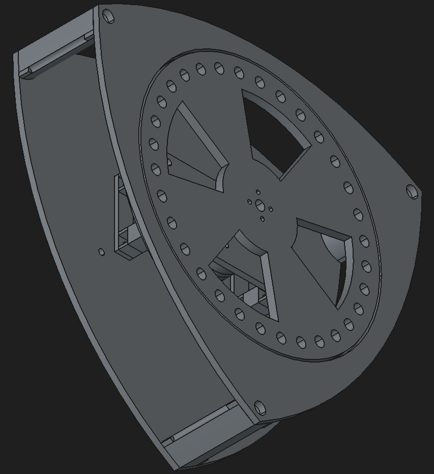

# 삼각형 셀프밸런싱 로봇

1축 밸런싱 휠을 통해 스스로 중심을 잡는 삼각형 로봇.

### 특징
외부 충격에 실시간으로 대응하여 균형을 유지.

가속도 센서를 3개 탑재하여, 센싱된 정보를 다수결로 결정하여 판단하도록 설계.


## 1. 요구사항
### 기능 요구사항
- FR-1(센싱) : MPU6500 3개를 이용해 실시간으로 자세 정보를 측정해야 한다.
- FR-2(결함 허용) : Voting 알고리즘을 구현한다. 3개의 센서 데이터를 비교해 이상치를 배제한다.
- FR-3(균형 유지) : 정상 센서 데이터를 이용해 자세 정보를 계산하고, 상태피드백 제어(각도·각속도·휠속도)를 통해 로봇이 균형을 유지해야 한다.
- FR-4(모터 제어) : BLDC 모터를 FOC 방식으로 제어해야 한다.
- FR-5(모터 피드백) : MT6701을 ABZ 증분 방식으로 읽어 모터 정보를 실시간으로 측정해야 한다.
- FR-6(무선 통신) : Wi-Fi를 이용하여 센서 데이터를 확인하거나 로봇을 제어할 수 있어야 한다.
- FR-7(안정성) : 외부 충격이 발생하더라도 균형을 회복해야 한다.
- FR-8(디지털 트윈) : 모바일 웹에서 로봇의 현재 자세를 실시간 3D로 확인할 수 있어야 한다.


### 센서 결함 시뮬레이션 및 검증 계획

실제 하드웨어 고장을 기다리지 않고, 센서 데이터를 인위적으로 변조하여 결함 상황을 재현한다.

모바일에서 Wi-Fi 기반 제어로 구현한다.

1. 센싱 정보 누락

    특성 센서의 값을 무효 처리 한다.

    (하드웨어 고장, 통신 끊어짐 상황 묘사)

2. 값 고정 오류

    특정 센서의 값이 고정된 값이나, 마지막 정상 값을 유지되도록 한다.

    (register lock, 센서 freeze 상황 묘사)

3. 점진적 변형

    특성 센서의 값이 지속적으로 변형되도록 한다.

    (센서 열화, IMU drift 상황 묘사)

4. 다중 장애

    2개 센서에 1~3번 현상이 나타나도록 한다.

    (단일 센서 모드로 동작하는 상황 묘사)

### 디지털 트윈

모바일 웹에서 로봇의 현재 자세를 실시간 3D로 확인한다.

- 자세 소스: 가속도 센서만 사용, voting 통과 융합 자세.
- 표현: 쿼터니언 (짐벌락 회피 목적).
- 통신: WebSocket. ESP32 → Spring 서버 → 브라우저 중계.
- 렌더: 별도 서버가 호스팅하는 웹(Three.js), 기존 프레임 `.obj` 모델 재사용.

상세: [docs/digital-twin.md](./docs/digital-twin.md)


## 2. 서버 / 대시보드

ESP32가 측정한 값을 브라우저에서 실시간으로 확인한다. ESP32를 웹서버로 쓰지 않고 **Spring 서버가 중계**한다.

```
ESP32 ──WS──► Spring 서버 ──WS──► 브라우저
              (중계 + 정적 호스팅)
```

대시보드 표시 항목:

- 밸런싱 상태 (기울기, 각속도, 기준 각도, q축 전압, 휠 각도)
- 센서 3개의 6축 값과 채널별 영점
- Voting 판정 — 가속도·자이로 각각의 채택/배제 채널
- 이상 이력 — 배제된 센서의 값, 채택 평균, 벌어진 폭을 표로 기록
- ESP32 시리얼 로그 미러링

상세: [docs/server.md](./docs/server.md)


## 3. 언어 / 빌드 환경

### 로봇 (ESP32)

| 항목 | 내용 |
|------|------|
| 언어 | C |
| 프레임워크 | ESP-IDF v5.5.4 |
| 빌드 | idf.py (CMake) |
| 타겟 보드 | ESP32 D1 Mini Live |

### 서버 / 대시보드

| 항목 | 내용 |
|------|------|
| 언어 | Java 21 |
| 프레임워크 | Spring Boot 4.1.0 (webmvc + websocket) |
| 빌드 | Gradle |
| 프론트 | 순수 HTML/CSS/JS, 라이브러리 무의존 |


## 4. 라이브러리


| 기능 | 구현 |
|------|------|
| FOC 모터제어 | 직접 구현 — `esp/components/foc/` |
| 자기인코더(MT6701) | 직접 구현 — ESP32 PCNT로 ABZ 펄스 카운트, `esp/components/encoder/` |
| 가속도센서(MPU6500) | 직접 구현 — 멀티플렉서 경유 3채널, `esp/components/mpu6050/` |
| Voting | 직접 구현 — 호스트 테스트 포함, `esp/components/voting/` |
| WebSocket 클라이언트 | `espressif/esp_websocket_client` (유일한 외부 의존) |


## 5. 주요 부품
메인보드: ESP32 D1 Mini Live

FOC 드라이버: SimpleFOC Mini

멀티플렉서: PCA9548A

가속도센서: MPU6500

자기인코더: MT6701

모터: 2804-100KV 브러시리스

## 6. 로봇 형상(임시)


